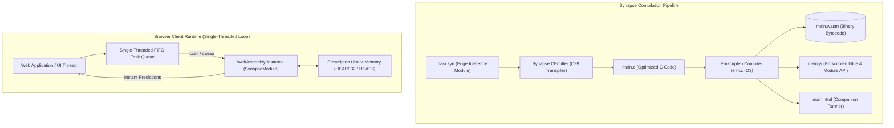

# Synapse Edge WebAssembly (WASM) Inference Architecture

An industrial reference architecture for compiling Synapse neural models and edge inference pipelines directly to **WebAssembly (`--target=wasm`)** for client-side execution in web browsers and edge runtimes.

This architecture enables **client-side matrix operations**, **INT8 quantization**, and **single-threaded non-blocking FIFO task scheduling** with zero server communication overhead, complete privacy, and microsecond client execution.

---

## 1. WebAssembly Compilation & Browser Execution Pipeline



---

## 2. Exported C-ABI Functions

The following functions are marked for export in the WebAssembly module:

| Exported Function | Return Type | Parameter Types | Description |
| :--- | :--- | :--- | :--- |
| `_relu_activation` | `f64` (number) | `x: f64` | Fast rectified linear activation |
| `_quantize_feature` | `int` (number) | `val: f64, scale: f64` | Symmetric/affine INT8 feature quantization |
| `_dequantize_feature` | `f64` (number) | `qval: int, scale: f64` | INT8 to float32 reconstruction |
| `_compute_linear_neuron` | `f64` (number) | `x: f64, w: f64, b: f64` | Linear GEMM neuron pass + ReLU |
| `_predict_anomaly` | `int` (number) | `score: f64, threshold: f64` | Thresholded classification / anomaly flag |

---

## 3. Web & JavaScript Integration Guide

### Step 1: Compiling to WebAssembly
```bash
# Build WASM binary, JS loader, and companion HTML test runner
synapse build examples/edge_wasm_inference/main.syn --target=wasm --html

# Or emit C source only for custom emcc pipelines
synapse build examples/edge_wasm_inference/main.syn --target=wasm --c-only
```

### Step 2: Loading in Modern JavaScript (Vite / Next.js / Vanilla JS)
```javascript
import createSynapseModule from './main.js';

async function initEdgeInference() {
  // 1. Initialize the modularized WebAssembly instance
  const Synapse = await createSynapseModule();
  console.log("Synapse WebAssembly Engine Loaded.");

  // 2. High-level invocation using ccall
  const sampleValue = 2.45;
  const weight = 0.85;
  const bias = -0.40;

  const activation = Synapse.ccall(
    'compute_linear_neuron',   // function name
    'number',                   // return type
    ['number', 'number', 'number'], // argument types
    [sampleValue, weight, bias] // arguments
  );

  const isAnomaly = Synapse.ccall(
    'predict_anomaly',
    'number',
    ['number', 'number'],
    [activation, 1.0]
  );

  console.log(`Neuron Output: ${activation}, Anomaly: ${isAnomaly === 1}`);
}

initEdgeInference();
```

### Step 3: Fast Function Binding with `cwrap`
For high-frequency loops (60/120 FPS games or canvas animations), pre-bind functions with `cwrap`:
```javascript
const predictAnomaly = Synapse.cwrap('predict_anomaly', 'number', ['number', 'number']);
const relu = Synapse.cwrap('relu_activation', 'number', ['number']);

// Microsecond invocation in render loop
const flag = predictAnomaly(relu(score), 0.85);
```

---

## 4. Single-Threaded Event Loop & Zero-Jank Scheduling

In browser environments, heavy computations on the main UI thread can cause frame drops and layout stutter. This module is architected for **non-blocking single-threaded execution**:

1. **Micro-Batching:** Tasks in the FIFO queue are processed in chunks bounded by `requestAnimationFrame` or `requestIdleCallback`.
2. **Web Worker Isolation:** The WASM module can run in an isolated Web Worker, receiving sensory input via `postMessage` and returning inference flags asynchronously.
3. **Zero Heap Allocation:** Because tensor operations and quantization use fixed stack/linear memory buffers, browser V8 garbage collection overhead is completely bypassed.

---

## 5. How to Run Locally

### Running with Synapse VM
```bash
synapse run examples/edge_wasm_inference/main.syn
```

### Emitting C Source & Inspecting Code
```bash
synapse build examples/edge_wasm_inference/main.syn --target=wasm --c-only
cat examples/edge_wasm_inference/main.c
```
