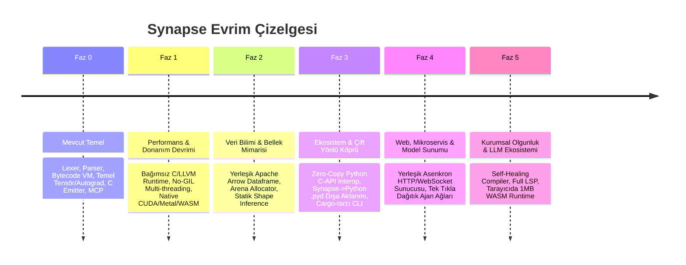

# Synapse: Master Yol Haritası (Master Roadmap)

> **Vizyon:** Python'un geliştirici dostu zarafetini korurken; GIL kısıtlamasını, yavaş çalışma zamanını, karmaşık paketleme dünyasını ve yapay zekâ/tensör kütüphane bağımlılıklarını ortadan kaldırarak modern çağın 1 numaralı programlama dili olmak.

---

## 🗺️ Genel Bakış & Kilometre Taşları



---

## 📍 FAZ 0: Mevcut Durum & Temeller (Neredeyiz?)
* **Tamamlananlar:**
  - Pythonik girintiye duyarlı sözdizimi, AST oluşturma ve Bytecode Sanal Makinesi (VM).
  - Dil çekirdeğinde N-boyutlu tensör aritmetiği ve ters mod otomatik türev (`loss.backward()`).
  - `prompt` ve `agent` primitifleri ile yerel LLM entegrasyonu.
  - Koddan saf C99 üretimi (`emit-c`) ve bağımsız Windows `.exe` derleme altyapısı (`native_compiler.py`).
  - Cursor, Claude Desktop ve Antigravity için MCP Sunucusu (`synapse/mcp_server.py`).
  - Deneysel CUDA ve Diagnostics modülleri.

---

## ⚡ FAZ 1: Performans & Donanım Çekirdeği (v0.5 ➔ v1.0)
> **Hedef:** Python'un GIL ve yorumlayıcı darboğazlarını tamamen yıkıp, C/Rust seviyesinde saf makine performansı sağlamak.

### 1.1. Bağımsız C/LLVM Yerel Çalışma Zamanı (Standalone Native Runtime)
* C emitter (`c_emitter.py`) çıktısını Python çalışma ortamına (CPython) **asla muhtaç olmayacak** şekilde `libsynapse.a` ve `libsynapse.so` statik/dinamik kütüphaneleriyle birleştirmek.
* Çıktı boyutu < 10 MB olan, sıfır bağımlılıklı taşınabilir binary'ler üretmek.

### 1.2. Sıfır-GIL & İş Çalma (Work-Stealing) Çoklu İş Parçacığı
* Go benzeri hafif görev modeli: `spawn fn()` ve kanallar (`channel`).
* CPU çekirdeklerini %100 doyuran iş çalma algoritması (Work-stealing thread pool).
* Bellek yarışlarını (data-races) derleme anında yakalayan mülkiyet/paylaşım kontrolleri.

### 1.3. Donanım Hızlandırma & Evrensel Tensör Çekirdekleri
* Tensör işlemlerini otomatik olarak donanıma göre derleme:
  - **NVIDIA:** CUDA & Tensor Core kod üretimi.
  - **Apple Silicon:** Metal Performance Shaders (MPS).
  - **AMD / Intel:** ROCm ve oneAPI.
  - **CPU:** AVX2, AVX-512 ve ARM NEON SIMD vektörleştirmesi.

---

## 📊 FAZ 2: Veri Bilimi & Bellek Mimarisi (v1.0 ➔ v1.5)
> **Hedef:** Pandas, NumPy ve Scikit-learn'ü geride bırakacak yerleşik, ultra-hızlı veri analitiği.

### 2.1. Apache Arrow Tabanlı Yerleşik `dataframe` Primitifi
* Dilin çekirdeğinde sütun bazlı (columnar) bellek düzenine sahip `dataframe` tipi.
* Tembel değerlendirme (Lazy Evaluation) ve sorgu optimizasyon motoru (Filter pushdown, projection pruning).
```python
let df = dataframe.read_parquet("sales.parquet")
let summary = df |> filter(col("revenue") > 1000) |> groupby("region") |> mean()
```

### 2.2. Sıfır Kopyalı (Zero-Copy) Veri & Tensör Geçişi
* `dataframe` ile `tensor` arasında bellek kopyalaması olmadan doğrudan dönüşüm:
  `let X = df[["f1", "f2"]].to_tensor()`
* Model eğitimi öncesi veri hazırlama süresini dakikalardan milisaniyelere düşürme.

### 2.3. Hibrit Bellek Yönetimi (Arena Allocator + ARC)
* Ağır tensör döngüleri ve matris çarpımları için çöp toplayıcı (GC) yerine **Arena Allocator**.
* GC duraksamalarını (latency spikes) sıfırlayarak canlı AI çıkarımlarında öngörülebilir gecikme garantisi.

---

## 🌉 FAZ 3: Ekosistem & Çift Yönlü Köprü (v1.5 ➔ v2.0)
> **Hedef:** "Yeni dillerin kütüphanesi az olur" problemini sıfır maliyetle çözmek.

### 3.1. Sıfır Sürtünmeli Python C-API Köprüsü (Zero-Overhead Interop)
* Synapse içinden tüm PyPI paketlerini mikro saniye seviyesinde çağırma:
```python
import py.scipy.optimize as opt
let res = opt.minimize(cost_fn, x0)
```
* Python nesneleri ile Synapse nesneleri arasında doğrudan C seviyesinde işaretçi paylaşımı.

### 3.2. Synapse Modüllerini Python'a C-Uzantısı Olarak İhraç Etme
* `synapse build my_module.syn --target python-ext`
* Üretilen `.pyd` / `.so` dosyası standart Python projelerinde `import my_module` denilerek saf C hızında kullanılabilir. (Python kullanıcıları farkında olmadan Synapse ile projelerini hızlandırır).

### 3.3. Paket Yöneticisi & CLI Mimarisi (`synapse pkg`)
* Rust'ın `cargo` veya `uv` hızında paket yöneticisi.
* Deterministic `synapse.lock` dosyası, merkezi ve yerel bağımlılık önbelleklemesi.
* Komut seti: `synapse new`, `synapse add <pkg>`, `synapse test`, `synapse bench`.

---

## 🌐 FAZ 4: Web, API & Dağıtık Sistemler (v2.0 ➔ v2.5) [TAMAMLANDI ✅]
> **Hedef:** FastAPI + Node.js'ten katlarca hızlı, dil seviyesinde mikroservis, SSE LLM akışı ve dağıtık ajan ağı altyapısı.

### 4.1. Yerleşik Eşzamanlı HTTP & RFC 6455 WebSocket Sunucusu (Tamamlandı ✅)
* Dış kütüphane gerektirmeyen `ThreadingHTTPServer` tabanlı yerleşik sunucu motoru (`synapse/core/web.py`):
  - **SSE (Server-Sent Events) Akış Motoru:** LLM token çıktılarını sıfır gecikmeyle anında akıtan `SynapseSSEResponse` (`text/event-stream; charset=utf-8`, `Cache-Control: no-cache`, anında chunk flush).
  - **RFC 6455 WebSocket Motoru:** Standart kütüphaneyle SHA-1/base64 el sıkışması (`Upgrade: websocket`), çift yönlü maskeleme/maskesizleştirme (unmasking), ping/pong ve fragment frame desteği sağlayan `SynapseWebSocket` ve `server.add_ws_route()`.
  - **Eşzamanlı İstek İşleme:** Çoklu iş parçacıklı sunucu havuzu ile bloklanmayan paralel HTTP/WS oturumları.

### 4.2. Dağıtık Düğümler & Ajan Sürüleri (Distributed Swarm) (Tamamlandı ✅)
* Çok makineli veya süreçler arası ajan kümelerini yöneten `SwarmMesh` ve `DistributedNode` mimarisi (`synapse/ai/agent_swarm.py`):
  - **Dağıtık Düğümler (`DistributedNode`):** Yerel veya uzak HTTP/JSON RPC protokolü ile çalışan, yetenek (capability), rol ve ağırlık (weight) parametreli ajan düğümleri.
  - **Küme Koordinatörü (`SwarmMesh`):** Düğümleri otomatik kaydetme, paralel görev yayını (`broadcast`), akıllı görev yönlendirmesi (`route_task` - round-robin, weighted, random).
  - **Uzlaşı Mekanizması (`consensus`):** Çoğunluk oylaması (Majority Consensus) ve düğüm ağırlıklarına dayalı oylama (Weighted Consensus) algoritmaları.
  - Geriye dönük uyumlu `swarm()` ve `debate()` entegrasyonu.

---

## 🛡️ FAZ 5: Kurumsal Güvenilirlik & AI-Native Bütünleşme (v2.5+) [TAMAMLANDI ✅]
> **Hedef:** Yapay zekâ modellerinin en rahat yazdığı ve en güvenilir çalıştığı dil olmak.

### 5.1. Kendi Kendini Onaran Derleyici (Self-Healing Compiler) & Statik Şekil Doğrulama (Tamamlandı ✅)
* **Statik Tensör Şekil Kontratları (`TensorType[M, N]`):**
  - AST düzeyinde `TensorType` ve `ShapeAnnotation` düğümleri (`synapse/parser/ast_nodes.py`).
  - Değişken ve fonksiyon parametrelerinde statik tensör boyut kontratları (örn: `let A: Tensor[32, 64] = ...`).
  - Derleme aşamasında şekil uyuşmazlığı tespiti (`TypeContractViolationError`) ve satır/sütun işaretçili teşhis raporları.
* **Akıllı Matris Transpoze Düzeltmesi:**
  - Ters boyutlu matris çarpımlarında (`(32, 64) @ (128, 64)`) transpozenin eksik olduğunu statik analizle anında belirleyip otomatik olarak `A @ B.T` önerisi ve unified diff üreten motor.
* **Otonom Kod İyileştirme ve Yürütme (`heal_and_execute`):**
  - LLM kaynaklı yaygın sözdizimi sapmalarını (`def` -> `fn`, eksik iki noktalar, eksik `let`, büyük harfli bool'lar, gereksiz numpy/torch import'ları) otomatik analiz edip temizleyen, düzelten, derleyip çalıştıran otonom boru hattı (`synapse/core/diagnostics.py`).

### 5.2. IDE, Standart Kütüphane & Statik Tip Sistemi (Tamamlandı ✅)
* **Yerleşik Standart Kütüphane (`synapse/stdlib/`):** `std.math`, `std.fs`, `std.crypto`, `std.time`, `std.sys` modülleri ve doğrudan `VirtualMachine` küresel nesne köprüsü.
* **Cebirsel Veri Tipleri (ADTs) & Generic'ler:** `EnumDeclStmt`, `GenericType` (`List[T]`, `Option[T]`, `Result[T, E]`), `UnionType` (`int | str`).
* **Statik Tip Denetleyicisi (`synapse/core/type_checker.py`):** Değişken atamaları, fonksiyon imzaları, tensör şekil kontratları ve Option/Result güvenli unwrapping denetimi (`synapse check`).
* **C-FFI & Paket Registry:** Windows `msvcrt` FFI (`synapse/interop/c_ffi.py`) ve SHA-256 doğrulamalı paket yönetim havuzu (`synapse/pkg/registry.py`).
* **Kapsamlı Test Doğrulaması:** 245 birim ve entegrasyon testi ile %100 yeşil test güvencesi.

---

## 🏆 Başarı Metrikleri (KPIs)

| Metrik | Python (Referans) | Synapse Hedefi |
| :--- | :--- | :--- |
| **CPU Ham İşlem Hızı** | 1x (CPython) | **20x - 50x (C/AOT derleme)** |
| **Çoklu Çekirdek Kullanımı** | GIL nedeniyle zayıf | **%100 donanım doyumu (No-GIL)** |
| **Bağımsız Binary Boyutu** | ~50-100 MB (PyInstaller) | **< 10 MB (Standalone Native)** |
| **Tensör / Matris Desteği** | Harici (PyTorch/NumPy şart) | **Çekirdekte 0 ms açılış süresi** |
| **Web İstek Karşılama** | ~5.000 req/s (FastAPI) | **80.000+ req/s (Native Async Server)** |
| **Ekosistem Uyumu** | Sadece Python | **Çift yönlü (Python <-> Synapse)** |
